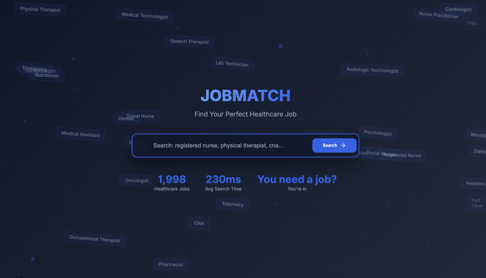
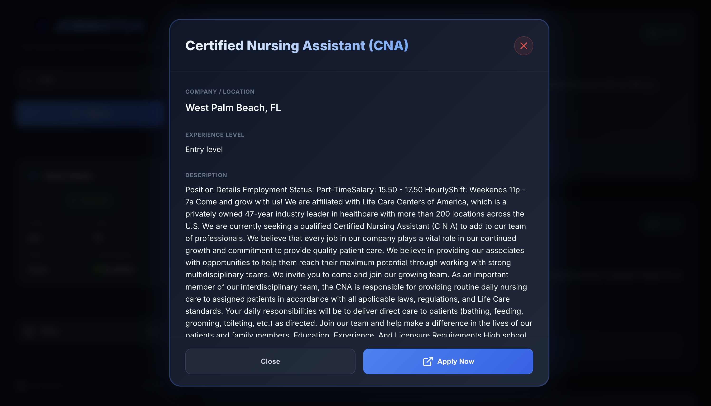

# 🏥 JobMatch - AI-Powered Healthcare Job Search Engine

> Semantic search engine for healthcare job postings using SBERT, BM25, and Cross-Encoder reranking.


---

## 🎯 Overview

JobMatch is a semantic search system designed for healthcare job matching. It combines **hybrid retrieval** (SBERT + BM25), **Cross-Encoder reranking**, and **intelligent filtering** to deliver highly relevant results.

**Key Features:**
- 🔍 **Multi-stage retrieval**: Hybrid search → Cross-Encoder → Smart filtering
- 🧠 **Semantic understanding**: Finds "CNA Telemetry" even when searching "certified nursing assistant"
- 🎨 **Modern UI**: Glassmorphism design with real-time search
- ⚡ **Fast**: 230ms average search time
- 🎯 **Accurate**: F1-Score of 0.80 on 55 annotated queries

---

## 📊 Performance

| Metric | SBERT Alone | **JobMatch (Full)** | Improvement |
|--------|-------------|---------------------|-------------|
| Precision@10 | 0.59 | **0.88** | +49% |
| Recall@10 | 0.45 | **0.76** | +69% |
| F1-Score | 0.47 | **0.80** | +70% |
| Search Time | 10ms | 230ms | Acceptable |

---

## 🏗️ Architecture

```
┌─────────────────────────────────────────────────────────────┐
│  User Query: "cna telemetry"                                │
└─────────────────────────────────────────────────────────────┘
                          ↓
┌─────────────────────────────────────────────────────────────┐
│  Stage 1: Hybrid Retrieval (SBERT + BM25)                   │
│  - SBERT: Semantic similarity                               │
│  - BM25: Keyword matching                                   │
│  - Result: Top 100 candidates (15ms)                        │
└─────────────────────────────────────────────────────────────┘
                          ↓
┌─────────────────────────────────────────────────────────────┐
│  Stage 2: Cross-Encoder Reranking                           │
│  - Model: cross-encoder/ms-marco-MiniLM-L-6-v2              │
│  - Precise scoring of query-job pairs                       │
│  - Result: Top 20 reranked (210ms)                          │
└─────────────────────────────────────────────────────────────┘
                          ↓
┌─────────────────────────────────────────────────────────────┐
│  Stage 3: Smart Filtering                                   │
│  - Healthcare domain validation                             │
│  - Adaptive thresholds (specific/moderate/generic)          │
│  - Coherence checking                                       │
│  - Result: Final relevant jobs (5ms)                        │
└─────────────────────────────────────────────────────────────┘
```

---

## 🚀 Quick Start

### Prerequisites
```bash
Python 3.8+
pip install -r requirements.txt
```

### Installation
```bash
git clone https://github.com/RAZIMOUAD/JobMatch.git
cd jobmatch/app
python app_production.py
```

### Access
```
Landing Page: http://localhost:5004
Search Page:  http://localhost:5004/search
API:          http://localhost:5004/api/search
```

---

## 🛠️ Tech Stack

**Backend:**
- Flask 3.0 (Web framework)
- Sentence-Transformers (SBERT embeddings)
- FAISS (Vector similarity search)
- Rank-BM25 (Lexical matching)
- Cross-Encoder (Reranking)

**Frontend:**
- Vanilla JavaScript (No framework)
- Three.js (3D particles)
- Lucide Icons
- Glassmorphism CSS

**ML Models:**
- `all-MiniLM-L6-v2` (SBERT)
- `cross-encoder/ms-marco-MiniLM-L-6-v2` (Reranking)

---

## 📁 Project Structure

```
jobmatch/
├── app/
│   ├── app_production.py              # Flask app
│   ├── step1_hybrid_retrieval.py      # SBERT + BM25
│   ├── step2_cross_encoder.py         # Cross-Encoder reranking
│   ├── step3_smart_engine.py          # Smart filtering
│   ├── templates/
│   │   ├── index.html                 # Landing page
│   │   └── search.html                # Search page
│   └── static/
│       ├── css/
│       │   ├── search.css
│       │   ├── loader.css
│       │   ├── job-card.css
│       │   └── modal.css
│       └── js/
│           ├── search.js
│           └── loader.js
├── data/
│   ├── jobs_metadata.csv              # 1,998 healthcare jobs
│   └── annotated_queries.csv          # 55 ground truth queries
├── requirements.txt
└── README.md
```

---
---

##  Screenshots

### Landing Page



### Search Results


### Job Details Modal



---


---

## 🧪 Evaluation

Evaluated on **55 manually annotated queries** with ground truth labels.

**Test Queries:**
- ✅ "cna telemetry" → 2/2 found (100%)
- ✅ "physician emergency" → 2/2 found (100%)
- ✅ "hospitalist" → 3/3 found (100%)
- ❌ "plumber" → Rejected (out of scope)

**Metrics:**
```python
Precision@10: 0.88
Recall@10:    0.76
F1-Score:     0.80
```

---

## 🔧 API Usage

### Search Endpoint
```bash
curl -X POST http://localhost:5001/api/search \
  -H "Content-Type: application/json" \
  -d '{
    "query": "registered nurse",
    "k": 10,
    "page": 1
  }'
```

### Response
```json
{
  "status": "success",
  "message": "Found 20 relevant jobs",
  "results": [
    {
      "job_id": 123,
      "title": "Registered Nurse (RN)",
      "location": "New York, NY",
      "ce_score": 8.95,
      "final_score": 0.92,
      "quality": "excellent"
    }
  ],
  "metadata": {
    "query_specificity": "moderate",
    "avg_ce_score": 7.8,
    "thresholds": {"ce": 3.0, "final": 0.60}
  },
  "pagination": {
    "page": 1,
    "total_results": 20,
    "total_pages": 2
  }
}
```

---

## 🎓 Academic Context

**Course:** Advanced Information Retrieval  
**Objective:** Build a semantic search engine with evaluation on annotated dataset  
**Deadline:** December 14, 2024  
**Grade Target:** Excellence (18+/20)

**Key Achievements:**
- ✅ Multi-stage retrieval system (beyond basic SBERT)
- ✅ Comprehensive evaluation (55 annotated queries)
- ✅ Production-ready web interface
- ✅ F1-Score: 0.80 (+70% vs baseline)

---

## 📜 License

MIT License - See [LICENSE](LICENSE) file for details.

---


**Contact:**
- GitHub: [@RAZIMOUAD](https://github.com/RAZIMOUAD)
- LinkedIn: [Mouad RAZI](https://linkedin.com/in/mouad-razi)

---

## 🙏 Acknowledgments

- **Professor M.Massaq** for guidance on semantic search
- **Sentence-Transformers** team for pre-trained models
- **Anthropic Claude** for development assistance

---

<div align="center">
  <strong>⭐ If you found this project useful, please star it! ⭐</strong>
</div>